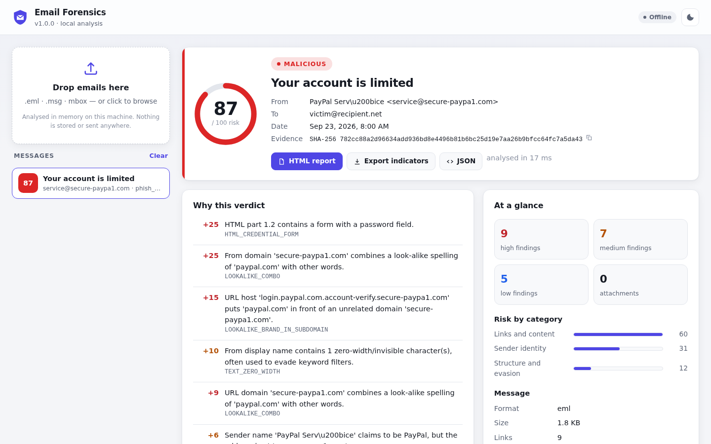

# email-forensics: full guide

Forensic analysis of suspicious email: headers, bodies and attachments. It is built for SOC triage, incident response and evidence handling.

It reads `.eml`, Outlook `.msg` and mbox files and explains its verdict finding by finding. It keeps evidence untouched and works fully offline by default. The core needs only the Python standard library (3.10+).

Research notes and the development plan: [`ROADMAP.md`](ROADMAP.md). What each day added: [`CHANGELOG.md`](CHANGELOG.md).

## Quick start

```bash
git clone https://github.com/ecst4syyy/email-forensics && cd email-forensics
python -m pip install .            # Python 3.10+; no other dependencies
email-forensics serve              # then open http://127.0.0.1:8025/ and drop an email
```



Or from the command line:

```bash
email-forensics analyze suspicious.eml                 # text report
email-forensics analyze suspicious.eml --format html -o report.html
```

To get a suspicious email as a file: in Outlook desktop, drag the message to a folder (`.msg`) or use *File › Save As*. In Outlook on the web or Gmail, use *Download* / *Show original › Download original* (`.eml`). Thunderbird and Apple Mail: *Save As* (`.eml`). The original file keeps the headers the analysis needs; a forwarded copy does not.

## Features

| Area | What it does |
|---|---|
| **Evidence** | Read-only loading with SHA-256/MD5, `.eml`, `.msg` (pure Python), mbox (per-message evidence), attached emails analysed recursively |
| **Headers & routing** | Sender/Reply-To/Return-Path mismatches, display-name spoofing, `Received` hop timeline with delays and origin IP, Authentication-Results, provider verdicts (Microsoft 365, SpamAssassin), mailer fingerprints |
| **Authentication** | Offline DKIM body-hash check. Opt-in DNS adds full DKIM/ARC signatures, SPF and DMARC re-verification, compared with the receiver's verdict. DNS can go over the system resolver or DoH, and lookups can be recorded and replayed |
| **Identity** | Lookalike domains: homoglyphs, typos, combosquatting, brand in a subdomain, mixed scripts, TLD swaps. Checks run against brands, the recipient's domain and your protected domains |
| **Body** | MIME tree, static HTML analysis (hidden text, forms, scripts, tracking, smuggling), URL extraction and heuristics, invisible Unicode, text/HTML divergence |
| **Attachments** | True file type, filename tricks and archive listing, with zip-bomb, traversal and password checks. Office macros (VBA, XLM, DDE, ActiveX, remote templates), RTF exploits, PDF, LNK, OneNote and scripts (PowerShell `-EncodedCommand` decoded) |
| **Detection** | Explainable 0–100 risk score and verdict. YARA over decoded content, plus custom JSON/TOML detection and suppression rules |
| **Enrichment** | Opt-in RDAP domain age, Team Cymru ASN, VirusTotal, URLhaus, MalwareBazaar and AbuseIPDB, with caching, rate limits and record/replay |
| **Output** | Text, JSON, safe self-contained HTML, IOC export (CSV/STIX 2.1/MISP) and SIEM events (JSON Lines, CEF) |
| **Cases** | Case folders with a hash-chained, Ed25519-signed chain of custody, signed reports, cross-message search and campaign indicators |
| **Web UI** | Drag-and-drop analysis in the browser with verdict, reasons, findings, delivery route, authentication, links, attachments (macros, PDF JavaScript, shortcuts), indicators and attached emails; light/dark, phone-friendly, exports |
| **Integration** | Local REST API, drop-folder watcher, `--fail-on` exit codes for pipelines |
| **Robustness** | Bounded parsers, per-analyzer isolation, per-message timeouts, fuzzed with over 100,000 inputs and a regression corpus |

## Usage

```bash
pip install -e ".[dev]"          # optional extras: [dns] (dnspython), [yara] (yara-python), [all]
email-forensics analyze suspicious.eml
email-forensics analyze reported.msg                      # Outlook messages
email-forensics analyze export.mbox --summary             # one line per message
email-forensics analyze suspicious.eml --format html -o report.html --iocs iocs.json   # STIX 2.1
email-forensics analyze suspicious.eml --iocs iocs.csv --fail-on suspicious
VT_API_KEY=... email-forensics analyze suspicious.eml --enrich --doh --enrich-record case42-enrich.json
email-forensics analyze inbox.mbox --summary --yara examples/yara --rules examples/rules/example.toml
email-forensics analyze --json --min-severity medium *.eml
email-forensics analyze suspicious.eml --extract-dir ./case42/attachments
email-forensics analyze suspicious.eml --protected-domain acme-corp.com --protected-domains-file partners.txt
email-forensics analyze suspicious.eml --online --dns-record case42-dns.json   # verify DKIM/SPF/DMARC/ARC now
email-forensics analyze suspicious.eml --dns-replay case42-dns.json            # reproduce later, offline
email-forensics analyze export.mbox --format jsonl -o events.jsonl              # SIEM events (or --format cef)
# or without installing:
PYTHONPATH=src python -m email_forensics analyze tests/fixtures/bec_spoof.eml
```

Exit code: `0` on success, `1` if `--fail-on` matched, `2` if an input file could not be loaded or the options were invalid.

## Web UI

`email-forensics serve` starts a local web app at <http://127.0.0.1:8025/>. Drop one or more `.eml`, `.msg` or mbox files onto the page (every message in a mailbox gets its own entry) and browse:

- **Verdict**: the score gauge, the findings that produced every point, and risk per category
- **Findings**, filterable by severity and searchable, with the evidence behind each one
- **Sender & route**: identity headers and the delivery path, oldest hop first, with the origin IP marked
- **Authentication**: what the receiving server recorded, and DKIM/ARC/SPF/DMARC re-verification
- **Links & content**: every URL (defanged, never clickable) and what the HTML shows vs. hides
- **Attachments**: true type, hashes, archive contents, macro source, DDE, PDF JavaScript, shortcut command lines
- **Indicators**, **attached emails** (drill into a forwarded phish) and the raw JSON
- Download the self-contained HTML report, or indicators as STIX 2.1 / MISP / CSV

All analysis options apply (`email-forensics serve --doh --protected-domain acme-corp.com --rules org.toml ...`), and the header shows which are active. The page is static and self-contained: no CDN, no tracking, nothing leaves your machine unless you enabled DNS or enrichment. Every value from an email is inserted as text, and a strict Content Security Policy (`script-src 'self'`, no inline code) backs that up. Uploaded files stay in the browser tab and in server memory only.

## REST API

```bash
email-forensics serve                                   # http://127.0.0.1:8025/ (web UI)
curl --data-binary @suspicious.eml 'http://127.0.0.1:8025/api/v1/analyze?format=summary'
curl -F file=@reported.msg -F format=html http://127.0.0.1:8025/api/v1/analyze > report.html
curl --data-binary @suspicious.eml 'http://127.0.0.1:8025/api/v1/iocs?format=misp'

# shared with a team: a token is required to listen on anything but loopback
export EMAIL_FORENSICS_API_TOKEN=$(python -c "import secrets; print(secrets.token_urlsafe(32))")
email-forensics serve --host 0.0.0.0 --timeout 60 --max-upload 25
curl -H "Authorization: Bearer $EMAIL_FORENSICS_API_TOKEN" --data-binary @x.eml http://host:8025/api/v1/analyze
```

| Endpoint | |
|---|---|
| `GET /` | Web UI (with a plain upload form when JavaScript is off) |
| `GET /api/v1/health` | Version, whether a token is required, and the enabled options. No token needed |
| `POST /api/v1/analyze?format=json\|html\|text\|summary\|jsonl\|cef\|bundle` | Report. The body is raw `.eml`/`.msg`/mbox bytes (optional `X-Filename` header, percent-encoded UTF-8 or raw UTF-8) or `multipart/form-data` with a `file` field |
| `POST /api/v1/iocs?format=stix\|misp\|csv` | Indicators |

Errors are JSON `{"error": ...}`: 400 bad input, 401 token, 411 no Content-Length, 413 too large, 422 not an email. All analysis options (`--online`, `--rules`, `--yara`, `--enrich`, `--timeout`, ...) apply to every request. `bundle` returns `{"reports": [...], "elapsed_ms": n}` with each report's indicators included (what the web UI uses). Uploads are analysed in memory and never stored. Connections are handled concurrently, but analyses run one at a time on the main thread, so `--timeout` works and memory stays bounded. Put a reverse proxy in front for TLS.

## Automation

```bash
# analyse everything dropped into a folder (e.g. a phishing-report mailbox export)
email-forensics watch /srv/reported --output-dir /srv/results --report-format html --rules org.toml
# one pass, e.g. from cron
email-forensics watch /srv/reported --output-dir /srv/results --once
# block a pipeline on suspicious mail
email-forensics analyze incoming/*.eml --summary --fail-on suspicious
```

`watch` analyses each file once, even after renames or restarts, because it tracks files by SHA-256 in `OUT/.processed`. It waits until a file stops changing before reading it. Reports go to `OUT/<sha256>.<ext>`, and `OUT/events.jsonl` gets one SIEM event per message for a forwarder (Filebeat, Splunk UF, Fluent Bit). Unreadable files are listed in `OUT/errors.jsonl`. Input files are never modified.

SIEM event fields (`--format jsonl`): `event_type`, `tool`, `analyzed_at`, `evidence` (path, sha256, format, container/parent hashes), `verdict`, `score`, `reasons` (top five), `email` (subject, from, display name, reply-to, return-path, to, cc, date, message-id), `findings` (codes), `attachments` (name, sha256, type) and `indicators` (type, value, role). CEF maps sender, recipients, subject, hash, verdict, findings and score to standard and custom fields; CEF severity is score/10.

## Case workflow

```bash
email-forensics case init cases/42 --name "Invoice phishing wave" --examiner "J. Doe"
email-forensics case add cases/42 reported/*.eml export.mbox --note "SOC ticket 4711"
email-forensics case analyze cases/42 --protected-domain acme-corp.com --doh --dns-record cases/42/dns.json
email-forensics case report cases/42           # case-report.html + iocs.csv
email-forensics case search cases/42 paypa1    # where else did this indicator appear?
email-forensics case verify cases/42           # custody chain, evidence hashes, report signatures
email-forensics case log cases/42
```

The signing key proves that reports and custody entries were produced with this case's key and have not changed since. It does not prove *who* held the key; protect it like any credential (or keep it outside the case folder with `--key`).

## How scoring works

Every finding contributes points by severity (high 25, medium 10, low 3, info 0) inside its category: sender identity, authentication, links and content, attachments, payload, sending software, structure and evasion. Within a category each further finding counts 60% of the previous one (capped at 60), so ten findings about one phishing link don't outweigh three independent signals. The total maps to `100 × (1 − e^(−points/50))`.

Some findings are near-conclusive on their own and set a minimum score: an auto-running macro with dangerous calls, a shortcut that runs PowerShell, HTML smuggling, a credential form, a double extension, a phishing-kit mailer, and so on. An attached message's score counts towards its parent. Points are never subtracted, because passing SPF/DKIM/DMARC proves who sent a message, not that it is benign; attackers authenticate their own lookalike domains. The verdict supports a human decision; the report shows the reasons so an analyst can check them.

## Finding codes

| Code | Severity | Meaning |
|---|---|---|
| `HDR_DISPLAY_NAME_SPOOF` | high | Display name contains an address from a different domain than the real sender |
| `ANALYSIS_TIMEOUT` | medium | The message did not finish within `--timeout` |
| `ANALYZER_ERROR` | low | One analyzer failed; the report is incomplete (please report it) |
| `BODY_ALTERNATIVES_DIFFER` | medium | Plain-text and HTML versions share almost no words |
| `NESTED_MESSAGE_SUSPICIOUS` | worst severity inside | An attached email has notable findings (see its nested report) |
| `NESTED_MESSAGE`, `MSG_SOURCE`, `MSG_LAST_MODIFIED_BY`, `AUTHV_DKIM_UNVERIFIABLE` | info | Input-format context |
| `MACRO_MALICIOUS_PATTERN`, `MACRO_STOMPED`, `MACRO_XLM`, `DOC_DDE`, `DOC_EXTERNAL_OBJECT`, `DOC_UNC_PATH`, `RTF_EXPLOIT_CLASS` | high | Office payload behaviour |
| `PDF_JAVASCRIPT`, `PDF_LAUNCH` | high | Active PDF content |
| `LNK_RUNS_COMMAND` | high | Shortcut launches PowerShell/cmd/mshta/... |
| `SCRIPT_DOWNLOADER`, `SCRIPT_ENCODED_COMMAND`, `SCRIPT_PERSISTENCE`, `SCRIPT_DEFENSE_EVASION`, `SCRIPT_RANSOMWARE` | high | Script behaviour |
| `DOC_EMBEDDED_OBJECT`, `PDF_EMBEDDED_FILE`, `ONENOTE_EMBEDDED_FILE` | high (risky type/name) / medium | Embedded files |
| `MACRO_AUTOEXEC`, `MACRO_SUSPICIOUS`, `DOC_ACTIVEX`, `PDF_AUTO_ACTION`, `PDF_SUBMIT_FORM`, `PDF_REMOTE_GOTO`, `PDF_RICHMEDIA`, `PDF_OBFUSCATED_NAMES`, `LNK_LONG_ARGUMENTS`, `LNK_ICON_DISGUISE`, `LNK_HIDDEN_WINDOW`, `SCRIPT_EXECUTION`, `SCRIPT_OBFUSCATED` | medium | |
| `DOC_REMOTE_IMAGE`, `PDF_XFA`, `PDF_ENCRYPTED`, `PDF_TRUNCATED` | low | |
| `DOC_METADATA`, `PDF_LINKS`, `LNK_MACHINE_ID` | info | Attribution and context |
| `YARA_MATCH` | from rule `meta.severity` (default high) | A YARA rule matched |
| `RULE_<ID>` | from the rule | A custom rule matched |
| `ENRICH_KNOWN_MALWARE`, `ENRICH_URLHAUS_LISTED` | high | Hash/URL known to malware databases |
| `ENRICH_NEW_DOMAIN`, `ENRICH_VT_DETECTIONS`, `ENRICH_ABUSIVE_IP` | high / medium | Newly registered domain; reputation hits |
| `ENRICH_IP_ASN`, `ENRICH_ERRORS` | info | Network context; failed lookups |
| `AUTHV_DKIM_BODY_MODIFIED` | high | Body no longer matches the DKIM body hash (works offline) |
| `AUTHV_DKIM_FAIL`, `AUTHV_DMARC_FAIL`, `AUTHV_SPF_FAIL` | high (DMARC: medium if p=none) | Re-verification failed |
| `AUTHV_DKIM_UNSIGNED_CONTENT` | high | Content after the `l=` limit is not covered by the signature |
| `AUTHV_MISMATCH` | high (DKIM) / medium (SPF, DMARC) | Receiver's recorded verdict differs from re-verification |
| `AUTHV_ARC_FAIL`, `AUTHV_DKIM_PERMERROR` (key missing/revoked), `AUTHV_SPF_SOFTFAIL`, `AUTHV_DKIM_WEAK_KEY` (<1024 bit) | medium | |
| `AUTHV_DMARC_NONE`, `AUTHV_DMARC_POLICY_NONE`, `AUTHV_DKIM_SHA1`, `AUTHV_DKIM_TESTING`, `AUTHV_DKIM_LENGTH_TAG`, `AUTHV_DKIM_INVALID`, `AUTHV_DNS_ERRORS`, other `AUTHV_SPF_*` | low | |
| `AUTHV_DKIM_PASS`, `AUTHV_SPF_PASS`, `AUTHV_DMARC_PASS`, `AUTHV_ARC_PASS`, `AUTHV_DKIM_EXPIRED`, `AUTHV_NO_DKIM`, `AUTHV_OFFLINE` | info | |
| `LOOKALIKE_HOMOGLYPH`, `LOOKALIKE_TYPO` | high | Domain visually confusable with / one typo from a protected domain |
| `LOOKALIKE_BRAND_IN_SUBDOMAIN` | high (full domain) / medium (name) | `paypal.com.evil.net` |
| `LOOKALIKE_COMBO` | high (look-alike spelling) / medium | `paypal-secure.com`, `acme-corp-invoices.com` |
| `LOOKALIKE_MIXED_SCRIPT` | high (Latin + Cyrillic/Greek/Armenian) / medium | Label mixes writing systems |
| `LOOKALIKE_TLD_SWAP` | medium | Your domain's name on another suffix |
| `HDR_DISPLAY_NAME_BRAND`, `HDR_DISPLAY_NAME_ORG` | high (free-mail) / medium | Brand or your organisation's name in the display name, unrelated address |
| `HDR_MAILER_PHISHING_KIT` | high | Mailer bundled with phishing kits |
| `PROVIDER_PHISH_VERDICT`, `PROVIDER_EXTERNAL_CLAIMS_INTERNAL` | high | Microsoft 365 phish/spoof verdict; unauthenticated external mail with an internal From |
| `HDR_PROVIDER_PATH_MISMATCH`, `HDR_MESSAGE_ID_PROVIDER_MISMATCH`, `HDR_PHP_SCRIPT`, `PROVIDER_SPAM_VERDICT` | medium | Provider claims not backed by the path; PHP web-server sending; spam verdicts |
| `HDR_MAILER_SCRIPT`, `HDR_MAILER_BULK`, `HDR_MAILER_OUTDATED`, `PROVIDER_BULK_VERDICT` | low | Sending-software context |
| `PROVIDER_FILTER_BYPASSED` | info | Spam filtering skipped by allow list or mail-flow rule |
| `ATT_EXECUTABLE` | high | Executable by extension or by content |
| `ATT_TYPE_MISMATCH` | high (executable/disk/HTML content) / medium | Content doesn't match the extension |
| `ATT_DOUBLE_EXTENSION` | high | `invoice.pdf.exe` style name |
| `ATT_DISK_IMAGE`, `ATT_ONENOTE` | high | ISO/IMG/VHD(X), OneNote |
| `ATT_OFFICE_MACRO`, `ATT_REMOTE_TEMPLATE`, `ATT_RTF_OBJECT` | high | VBA project, external template, RTF OLE objects |
| `ATT_HTML_SMUGGLING` | high | HTML attachment that assembles a file in the browser |
| `ATT_ARCHIVE_RISKY_MEMBER`, `ATT_ZIP_BOMB` | high | Risky file inside an archive; decompression bomb |
| `ATT_ENCRYPTED_ARCHIVE` | medium (high if body mentions a password) | Password-protected archive members |
| `ATT_HTML`, `ATT_MACRO_EXTENSION`, `ATT_DECLARED_TYPE_MISMATCH`, `ATT_FILENAME_CONFLICT`, `ATT_FILENAME_PADDING`, `ATT_FILENAME_PATH`, `ATT_ARCHIVE_PATH_TRAVERSAL` | medium | Attachment traits worth a look |
| `ATT_ARCHIVE_NESTED`, `ATT_ARCHIVE_UNINSPECTED`, `ATT_ARCHIVE_CORRUPT`, `ATT_ARCHIVE_TRUNCATED` | low | Archive could not be fully inspected |
| `URL_TEXT_MISMATCH` | high | Link text shows one domain but the link goes to another |
| `URL_USERINFO` | high | `http://trusted.com@evil.com/` style URL |
| `URL_DANGEROUS_SCHEME` | high | `javascript:`, `vbscript:`, `data:` or `file:` link |
| `HTML_CREDENTIAL_FORM` | high | HTML form with a password field |
| `TEXT_BIDI_CONTROL` | high (subject/sender) / medium (body) | Bidirectional control characters that reverse displayed text |
| `URL_IP_HOST`, `URL_IDN_HOST`, `URL_ENCODED_HOST` | medium | Raw IP host, punycode/non-ASCII host, percent-encoded host |
| `HTML_SCRIPT`, `HTML_EVENT_HANDLERS`, `HTML_FORM`, `HTML_EMBEDDED_FRAME`, `HTML_META_REFRESH` | medium | Active or interactive HTML content |
| `HTML_HIDDEN_TEXT` | medium (≥20 words) / low | CSS-hidden text (filter poisoning or smuggling) |
| `TEXT_ZERO_WIDTH` | medium (subject/sender) / low (body) | Zero-width characters splitting words |
| `MIME_TOO_DEEP`, `MIME_TOO_MANY_PARTS` | medium | Analysis limits hit (possible evasion or DoS) |
| `URL_SHORTENER`, `URL_NONSTANDARD_PORT`, `URL_DEEP_SUBDOMAIN`, `URL_MALFORMED` | low | URL traits worth a look |
| `HTML_BASE_HREF`, `HTML_TRUNCATED`, `BODY_IMAGE_ONLY`, `BODY_CHARSET_PROBLEM`, `MIME_PART_DEFECTS`, `MIME_UNKNOWN_TRANSFER_ENCODING`, `HDR_ENCODED_WORD_ERROR` | low | Structural or evasion signals |
| `HTML_TRACKING_PIXEL`, `HTML_REMOTE_RESOURCES`, `BODY_NO_TEXT` | info | Context |
| `AUTH_<METHOD>_<RESULT>` | high/medium/low | SPF/DKIM/DMARC/ARC verdict that is not `pass` (e.g. `AUTH_SPF_FAIL`) |
| `HDR_REPLY_TO_MISMATCH` | medium | Reply-To domain differs from From domain (BEC) |
| `HDR_DUPLICATE` | medium | A header that must appear once appears several times |
| `HDR_MULTIPLE_FROM_ADDRESSES` | medium | From contains more than one address |
| `HDR_MISSING_FROM` | medium | No From header |
| `HDR_DATE_AFTER_DELIVERY` | medium | Date header is later than final delivery |
| `RCV_TIME_REVERSAL` | medium | A hop is timestamped before the previous hop |
| `HDR_RETURN_PATH_MISMATCH` | low | Envelope sender domain differs from From domain |
| `HDR_SENDER_MISMATCH` | low | Sender domain differs from From domain |
| `AUTH_DKIM_NOT_ALIGNED` | low | DKIM passed only for domains unrelated to From |
| `HDR_DATE_SKEW` | low | Date differs from first hop by more than 1h |
| `RCV_LONG_DELAY` | low | A hop took more than 1h |
| `RCV_BAD_TIMESTAMP`, `HDR_BAD_DATE`, `HDR_MISSING_DATE`, `HDR_MISSING_MESSAGE_ID`, `RCV_NO_HOPS`, `PARSE_DEFECTS` | low | Structural problems |
| `RCV_ORIGIN_IP`, `HDR_X_ORIGINATING_IP`, `HDR_MESSAGE_ID_DOMAIN_MISMATCH`, `AUTH_MULTIPLE_SERVERS`, `AUTH_RESULTS_MISSING` | info | Context for the investigator |

## Security considerations

- **Evidence is never executed, rendered or fetched.** HTML is parsed statically, scripts and macros are only read, and no URL in a message is ever requested. Reports are escaped and defanged, and the HTML report carries a `default-src 'none'` CSP.
- **Offline by default.** DNS (`--online`/`--doh`) and enrichment (`--enrich`) are opt-in. Enrichment sends indicators (hashes, domains, URLs, IPs) to third parties, never files. API keys are read from the environment and never written to reports, caches or recordings.
- **Hostile input is expected.** Parsers have hard limits on size, nesting, decompression and member counts. One analyzer failing does not lose the report. `--timeout` bounds each message. Still, analyse untrusted mail in a disposable, unprivileged environment, as with any parser.
- **The API** listens only on loopback unless a token of at least 16 characters is set. It compares tokens in constant time, rejects oversized and chunked uploads, sends `nosniff`/`no-store`/CSP headers and stores nothing. It has no TLS of its own; use a reverse proxy.
- **Signed case reports** prove integrity and which key signed them, not who held the key. Protect the signing key.

## Known limitations

- SPF and DMARC are evaluated against **today's** DNS. Records may have changed since delivery, and DKIM keys are often rotated (a missing key is reported, not treated as forgery). `--dns-record` preserves exactly what was seen.
- Enrichment answers describe the indicator **today**; record them (`--enrich-record`) at analysis time. Domain age is compared with the message date.
- The bundled Public Suffix List is a snapshot (version in the file header); refresh it occasionally.
- There is no trust boundary configuration yet. `Received` hops below your own MX can be forged by the sender.
- **PST/OST** mailboxes are not read directly. Convert them first, e.g. `readpst -M -o out/ mailbox.pst` (from libpst/pst-utils), which writes mbox or `.eml` files, then analyse those.
- `.msg` conversion keeps the original headers but rebuilds the MIME body, so DKIM can't be verified on `.msg` evidence; get the original `.eml` from the server when authentication matters.
- RAR / 7z / CAB / ISO contents are not listed (flagged as uninspected). Optional extras could add them later.
- Excel 4.0 macros are detected in OOXML (`.xlsm`) but not in legacy binary `.xls` (BIFF8) workbooks; PowerPoint binary VBA is not extracted.
- PDF analysis decodes FlateDecode only (not LZW/ASCIIHex/ASCII85 or encrypted streams); JavaScript is reported, never executed or deobfuscated.
- QR codes in images/PDFs ("quishing") are not decoded.
- Lookalike detection uses a practical subset of Unicode confusables, not the full TR39 table.
- Provider verdict headers are only trustworthy if your own tenant or gateway added them. The tool reports them but can't verify who added them.
- Hidden-text detection covers inline styles, the `hidden` attribute and simple `.class` / `#id` rules in `<style>` blocks (not complex selectors).

## Development

```bash
pip install -e ".[dev]"
python -m pytest
python -m pyflakes src tests scripts
pip install playwright && playwright install chromium   # optional: enables tests/test_web_ui.py
python tests/fixtures/build_attachments_fixture.py   # regenerate the (inert) attachment fixture
python tests/fixtures/build_regression_corpus.py     # regenerate the fuzzing regression corpus
python scripts/fuzz.py --iterations 20000 --seed 1   # long fuzz campaign; crashers go to fuzz-crashes/
```

The DKIM/ARC fixtures in `tests/fixtures/dkim/` were signed by the independent dkimpy library (`tests/fixtures/build_dkim_fixtures.py`, development-only) so the verifier is tested against a reference implementation, not against itself.

`tests/cfbwriter.py` builds compound files, VBA projects, OLE packages and Outlook `.msg` files for tests; its output was validated with olefile, olevba and extract-msg. `tests/fixtures/vba/` holds a real Excel-made VBA project (see its README).

Test samples in `tests/samples.py` only imitate the structure of malicious files (headers, archive layout, markers). They contain no working code.

Layout of `src/email_forensics/`:

| Module | Role |
|---|---|
| `loader` | Read evidence, hash it, detect format (.eml/.msg/mbox), parse it |
| `msg` | Outlook .msg to MIME (MAPI properties, LZFu RTF) |
| `headers` → `rules` | Header extraction → header findings |
| `mime` | MIME tree walk, safe decoding |
| `html_analysis`, `urls`, `textcheck` | HTML, URL and Unicode analysis |
| `psl`, `crypto`, `resolver` | Public Suffix List, RSA/Ed25519, pluggable and recordable DNS |
| `dkimcheck`, `spf`, `dmarc`, `auth` | DKIM/ARC, SPF, DMARC, re-verification findings |
| `brands`, `lookalike`, `mailer`, `identity` | Reference data, lookalike engine, mailer fingerprints, identity findings |
| `cfb`, `vba`, `office`, `pdf`, `lnk`, `scripts`, `payloads` | Payload parsers and their findings |
| `filetype`, `archives`, `attachments` | Magic-byte detection, bounded archive listing, attachment findings and extraction |
| `body` | Body orchestration and body findings |
| `domains` | Shared domain helpers |
| `analyzer` | Runs everything and builds the `Report` |
| `enrich` | Opt-in enrichment providers, cache, recording/replay |
| `yara_scan`, `custom_rules` | YARA scanning; JSON/TOML detection and suppression rules |
| `scoring` | Score, verdict and reasons |
| `case` | Case folders, custody chain, signing, search, case report |
| `report`, `report_html`, `iocs`, `siem` | Text/JSON/HTML output, IOC export (CSV/STIX/MISP), SIEM events (JSON Lines/CEF) |
| `server`, `web/`, `watch`, `cli` | REST API, web UI (static HTML/CSS/JS), drop-folder watcher, command line |

## Third-party data

`src/email_forensics/data/public_suffix_list.dat` is the [Public Suffix List](https://publicsuffix.org/), distributed under the Mozilla Public License 2.0.
